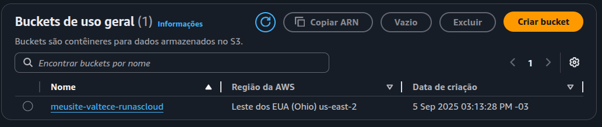
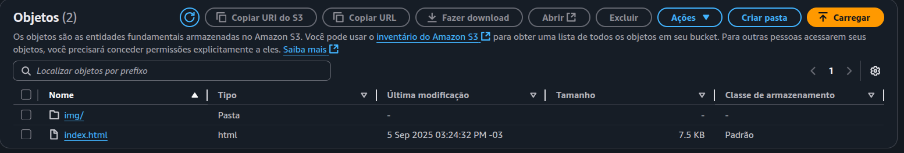
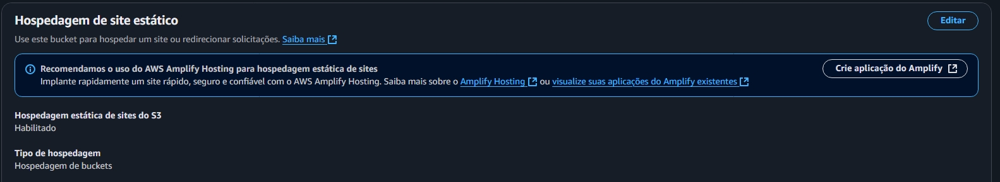
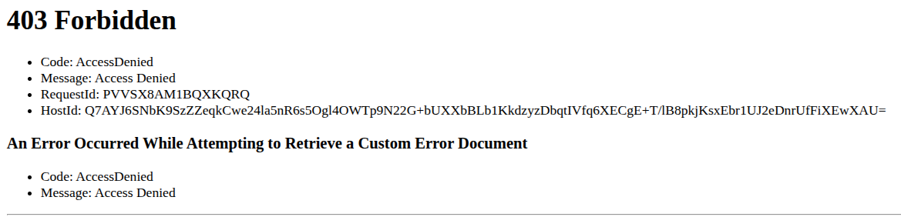
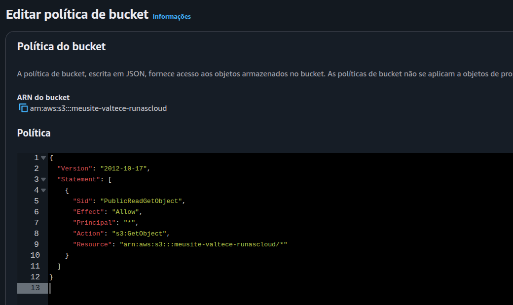
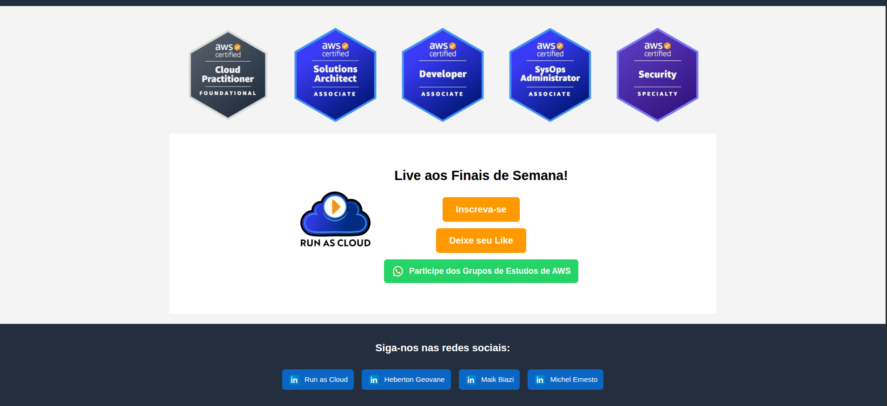

# 🌐 Publicação de Site Estático com AWS S3 - Projeto prático Run as Cloud!

## Objetivo

Aprender a configurar e hospedar sites estáticos (HTML, CSS e JavaScript) em buckets S3 da AWS, tornando-os acessíveis ao público e aplicando corretamente permissões e políticas para evitar erros como o 403 Forbidden.

## O que aprendi:

- O que é o Amazon S3
- Diferença entre sites estáticos e dinâmicos
- Como criar um bucket S3 e configurar a hospedagem estática
- Como lidar com erro 403 (Access Denied)
- Como aplicar uma política pública de leitura no bucket

## Etapas realizadas:

- 1️. Criação do Bucket: 
- 2️⃣. Fazer Uploads dos arquivos: 
- 3️⃣. Habilitar hospedagem estática 
- 4️⃣. Tentar acessar o site 
- 5️⃣. Corrigir o erro com a Política Pública 
- 6️⃣. Site funcionando! 